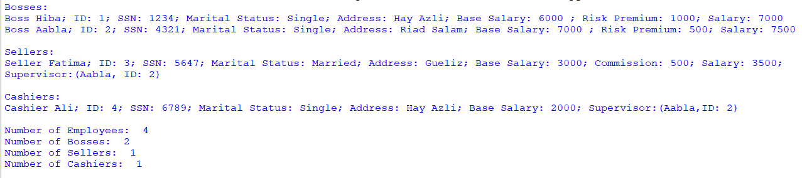

## Description
A Python-based employee management system that utilizes classes such as Employee, Boss, Seller, and Cashier to represent different employee roles within an organization. The program demonstrates the creation of instances for various employees (bosses, sellers, cashiers) and showcases their details, including salaries and relationships (such as supervisors). Additionally, it provides functionality to track and display the number of employees, bosses, sellers, and cashiers within the system.
## Example Usage

